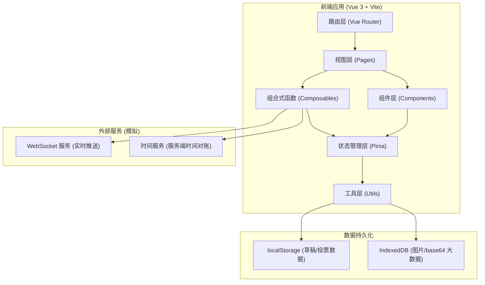
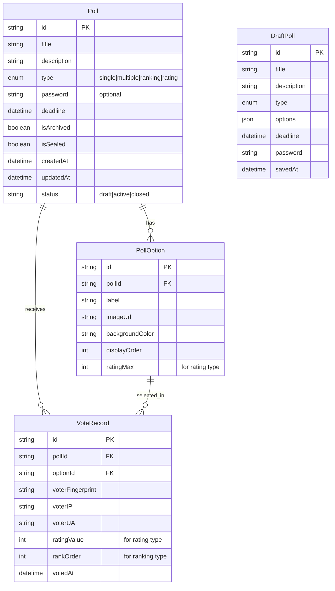

## 1. 架构设计



## 2. 技术说明

- **前端框架**：Vue 3 + TypeScript
- **构建工具**：Vite（开发端口 5176）
- **状态管理**：Pinia
- **路由**：Vue Router 4
- **样式方案**：SCSS 模块化（CSS Modules + SCSS 预处理器），不使用 Tailwind
- **图表库**：vue-chartjs（包装 Chart.js 4）
- **图标库**：@iconify/vue（Material Design Icons 集合）
- **实时通信**：WebSocket（原生 API + 自封装重连逻辑）
- **拖拽排序**：vuedraggable（基于 SortableJS）
- **数据持久化**：localStorage（草稿、投票数据、配置）
- **初始化工具**：vite-init (vue-ts 模板)

## 3. 路由定义

| 路由 | 用途 |
|------|------|
| `/` | 投票列表页，展示所有投票 |
| `/create` | 新建投票页 |
| `/edit/:id` | 编辑投票页 |
| `/poll/:id` | 投票参与页（参与者视角） |
| `/result/:id` | 实时结果页 |
| `/verify/:id` | 口令验证页（口令模式入口） |

## 4. API 定义（纯前端模拟）

本项目为纯前端应用，无后端 API。数据交互通过以下方式模拟：

### 4.1 WebSocket 消息协议

```typescript
interface WSMessage {
  type: 'vote_update' | 'poll_closed' | 'connection_established'
  payload: {
    pollId: string
    optionId?: string
    voterFingerprint?: string
    timestamp: number
    voteCounts?: Record<string, number>
  }
}
```

### 4.2 时间校正接口

```typescript
interface TimeSyncResult {
  serverTime: number
  clientTime: number
  offset: number
}
```

## 5. 数据模型

### 5.1 数据模型定义



### 5.2 数据定义

```typescript
type PollType = 'single' | 'multiple' | 'ranking' | 'rating'
type PollStatus = 'draft' | 'active' | 'closed'

interface Poll {
  id: string
  title: string
  description: string
  type: PollType
  password?: string
  deadline: number
  isArchived: boolean
  isSealed: boolean
  createdAt: number
  updatedAt: number
  status: PollStatus
  options: PollOption[]
  settings: {
    maxSelections?: number
    ratingMin: number
    ratingMax: number
    ratingStep: number
  }
}

interface PollOption {
  id: string
  pollId: string
  label: string
  imageUrl?: string
  backgroundColor?: string
  displayOrder: number
}

interface VoteRecord {
  id: string
  pollId: string
  selections: {
    optionId: string
    ratingValue?: number
    rankOrder?: number
  }[]
  voterFingerprint: string
  voterIP: string
  voterUA: string
  votedAt: number
}

interface AntiFraudConfig {
  ipRateLimit: number
  uaBlacklist: string[]
  uaWhitelist: string[]
  fingerprintThreshold: number
  voteFrequencyThreshold: number
  riskScoreBreakpoint: number
}
```

## 6. 项目目录结构

```
src/
├── assets/              # 静态资源
│   └── styles/          # SCSS 全局变量、混入
├── components/          # 通用组件
│   ├── common/          # 通用 UI 组件
│   ├── poll/            # 投票相关组件
│   └── chart/           # 图表组件
├── composables/         # 组合式函数
│   ├── useWebSocket.ts
│   ├── useTimeSync.ts
│   ├── useAntiFraud.ts
│   ├── useLocalStorage.ts
│   └── useCountdown.ts
├── pages/               # 页面视图
│   ├── PollList.vue
│   ├── PollCreate.vue
│   ├── PollEdit.vue
│   ├── PollVote.vue
│   ├── PollResult.vue
│   └── PasswordVerify.vue
├── stores/              # Pinia Store
│   ├── pollStore.ts
│   └── voteStore.ts
├── types/               # TypeScript 类型定义
│   └── index.ts
├── utils/               # 工具函数
│   ├── id.ts
│   ├── fingerprint.ts
│   ├── export.ts
│   └── timeSync.ts
├── router/              # 路由配置
│   └── index.ts
├── App.vue
└── main.ts
```
